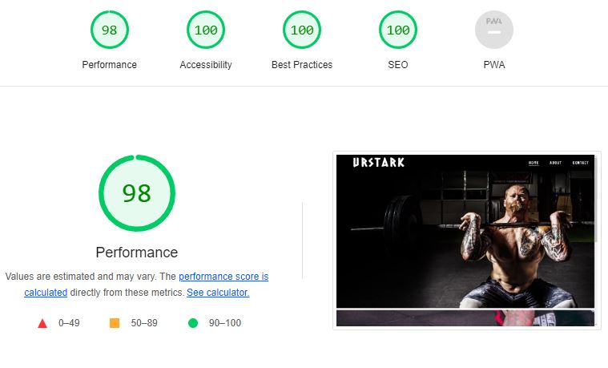

# Urstark Weightlifting Club

Urstark Weightlifting Club is a weightlifting club where athletes train and compete in the strenght sport Olympic Weightlifting. The Urstark Weightlifting Club website is the landing page targeting people of all ages seeking information about said weightlifting club. 

While navigating the website, users will be able to find information about the clubs official team and the sport in general, as well as the open hours and days and links to official social media accounts. There is also a contact form to be able to get in touch with the club. 

## Features

- Navigation
    - Users visiting the website will find at the top the Urstark Weightlifting Club logo and several navigational links, taking the user to different pages of the website. 
    - As the weightlifting club is based in Sweden, the font of the logo carries an aesthetic reminding of old norse runes. 
    - The name of the navigational links tell the user where they will take them in a clear manner and the the font contrasts with the background to make for easier reading. The font of the navigational links are continually used throughout the rest of the website to provide a consistent user experience. 
    - In the footer, icons to the weightlifting clubs social media accounts are also provided for easy access at the bottom of the pages. 

- The Home page
    - The Home page contains two background images depicting the weightlifting clubs athletes in action. 
    - Users are met with a welcoming message that aims to inspire them to want to join, train and compete for the weightlifting club. 
    - The text in the message is contrasted by a semi-transparent background to further support viewer readablitiy, as well as create a coherent user experience. 
    - At the bottom of the page, users will find the open hours of the weightlifting club. 

- The About page 
    - The About page contains short and concise information about the weightlifting clubs official competing team and the sport in general. 
    - The informational text section in this page uses the same layout as the text section in the Home page and Contact page. 

- The Contact page 
    - The Contact page contains a contact form, encouraging users the to intiate contact with the weightlifting club. 
    - The form collects the users details; fist name, last name, email address and and optional message. 
    - The form section in this page uses the same layout as the text section in the Home page and About page. 

    ## Testing
     
- I have tested that this website works in both Chrome and Firefox browsers. 
- The responsive design is tested and works as I intended. This websites responsiveness is set to three general screens sizes displayed in 
Chrome DevTools device toolbar; Mobile L 425px, Tablet 768px and Laptop L 1440px. 
- I have confirmed that the header, navigation, home, about, contact are all easy to read and understand. 
- I have confirmed the contact form works, requires entries in every field and submit button works. 

## Validator testing

- HTML
    - No erros were returned when passing through the offical W3C validator. 
- CSS
    - No erros were found when passing through the offical (Jigsaw) validator. 
- Accessibility
    - I confirmed that the colors and fonts chosen are easy to read and accessible by running it through Lighthouse in DevTools. 
    #

    

## Deployment

- This site was deployed to GitHub pages. The steps to deploy are the following: 
    - In the GitHub repository, navigate to Settings tab. 
    - From the source dropdown menu, select main branch. 
    - When the main branch has been selected, the page provided the link to the completed website. 

The live link can be found here: [Urstark Weightlifting Club](https://csilfverskiold.github.io/urstark-weightlifting-club/)

## Credits

- Content
    - The code used to create textarea in the contact form was found at: [Stack Overflow](https://bit.ly/3tmtsVa)
    - The code used to add border-space in open hours section: [W3Docs](https://bit.ly/3NXJcrd)
    - The code to set float position of nav-links without reversed list order: [Codepen](https://codepen.io/ConStambo/pen/WxRQVq)
- Media 
    - All images used are from: [Pexels](https://pexels.com) 
    - All icons for social media links are from: [Font Awesome](https://fontawesome.com)
    - The code used to make the social media links was from: CI [Love Running](http://bit.ly/3g08bgT)
