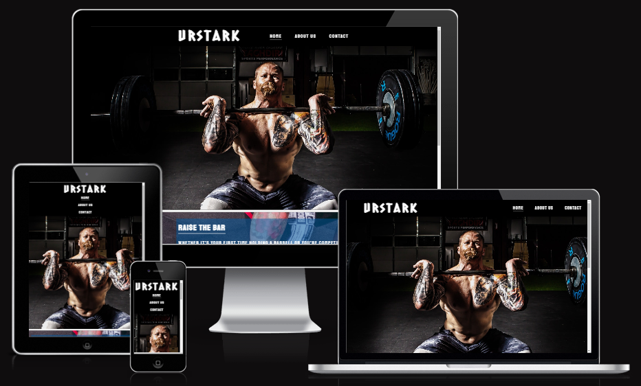
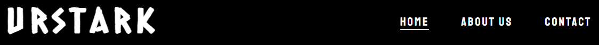
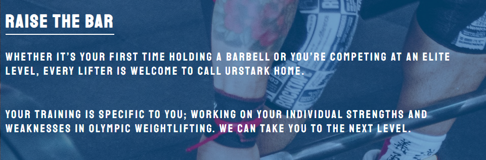
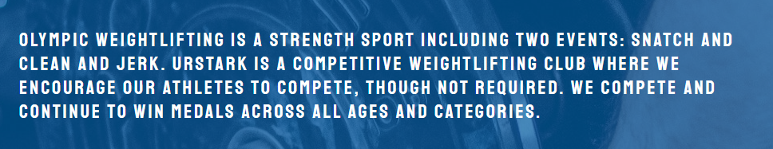
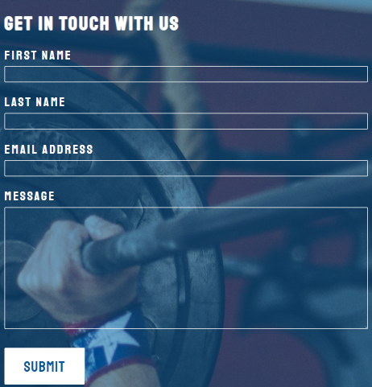
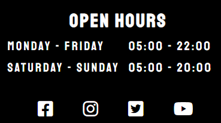
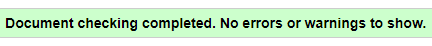
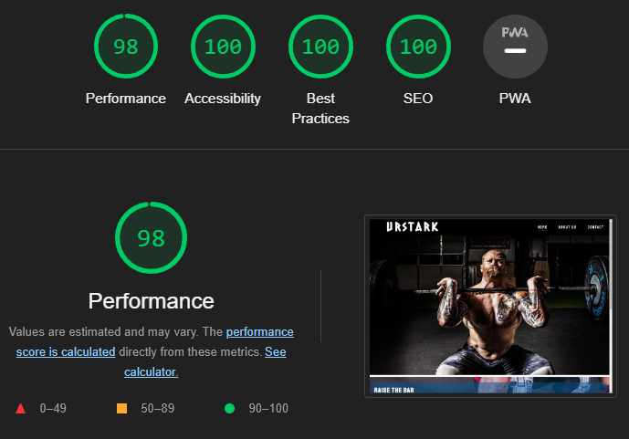
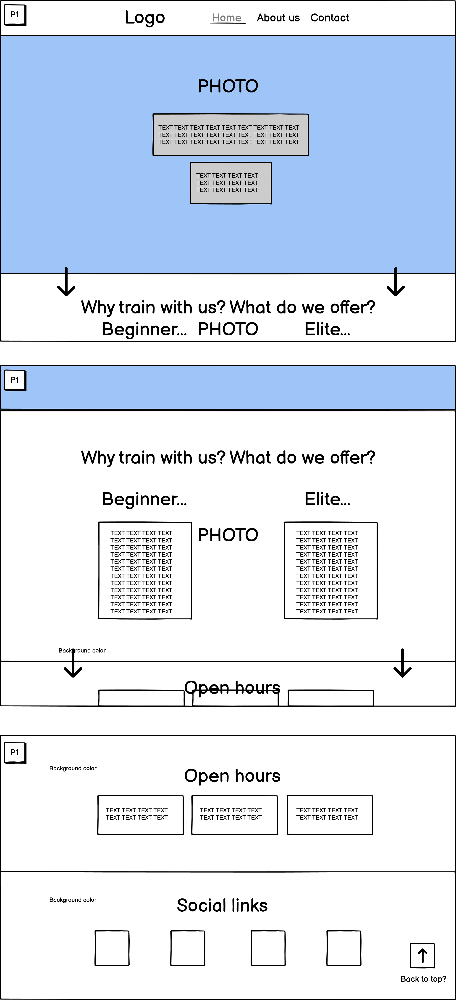

# Urstark Weightlifting Club

Urstark Weightlifting Club is a weightlifting club where athletes train and compete in the strength sport Olympic Weightlifting. The Urstark Weightlifting Club website is the landing page targeting people of all ages seeking information about said weightlifting club. 

While navigating the website, users will be able to find information about the clubs official team and the sport in general, as well as the open hours and days and links to official social media accounts. There is also a contact form to be able to get in touch with the club. 

## Features

- Navigation
    - Users visiting the website will find at the top the Urstark Weightlifting Club logo and several navigational links, taking the user to different pages of the website. 
    - As the weightlifting club is based in Sweden, the font of the logo carries an aesthetic reminding of old norse runes. Visible and strong.
    - The name of the navigational links tell the user where they will take them in a clear manner and the the font contrasts with the background to make for easier reading. The font of the navigational links are continually used throughout the rest of the website to provide a consistent user experience. 

- The Home page
    - The Home page contains two background images depicting the weightlifting clubs athletes in action. 
    - Users are met with a welcoming message that aims to inspire them to want to join, train and compete for the weightlifting club. 
    - The text in the message is contrasted by a semi-transparent background to further support viewer readablitiy, as well as create a coherent user experience. 

- The About Us page 
    - The About page contains short and concise information about the weightlifting clubs official competing team and the sport in general. 
    - The informational text section in this page uses the same layout as the text section in the Home page and Contact page. 

- The Contact page 
    - The Contact page contains a contact form, encouraging users the to intiate contact with the weightlifting club. 
    - The form collects the users details; fist name, last name, email address and optional message. To use form, user data input is required in all fields (except optional message). 
    - The form section in this page uses the same layout as the text section in the Home page and About page. 

- Footer 
    - At the bottom of each page, users will find the open hours of the weightlifting club, letting them know the availability of the club. Users will also find clickable icons taking them to the weightlifting clubs social media accounts.

 

## Testing
     
- I have tested that this website works as intended in browsers Chrome, Firefox and Edge. 
- The responsive design is tested and works as intended. This websites responsiveness is set at three break points: 1500px, 800px and 425px. To test the responsiveness I checked the website through [Responsive Tool 1](https://responsivedesignchecker.com/) and [Responsive Tool 2](https://ui.dev/amiresponsive). I also constantly used Chrome devtools built in function to test the responsiveness while building the website.
- I have confirmed that the header, navigation, home, about, contact are all easy to read and understand. 
- I have confirmed the contact form works, requires entries in every field and submit button works. 

This website was built for desktop first, which proved to be a difficult approach that I would not recommend doing again. In this approach there turned out to be many unforseen challenges during the design process for smaller devices. The honest reason for building desktop first was simply because of my own ignorance. However, looking back at the challenges faced, I have gained more knowledge and a better understanding of the mobile first principle. 

 

### Bugs

Solved bugs

- I discovered a responsive issue with the contact pages form, the text element in the about page and the text element in the home page. 
    - This issue was primarily due to their position being absolute. The solution was to change it to relative. 
- Background images were not aligning properly. 
    - The solution was to edit the background properties in the CSS file. 

## Validator testing

- HTML
    - No errors were returned when passing through the offical W3C validator. 

- CSS
    - No errors were found when passing through the offical (Jigsaw) validator. 
- Accessibility
    - I confirmed that the colors and fonts chosen are easy to read and accessible by running it through Lighthouse in DevTools. 

 

## Planning 

- Before building, when planning this website I used Balsamiq Wireframes tool. It allowed me to make a basic sketch of what I wanted the the website to look like, what features to include and where to place them. This proved to be very useful as I could base my decisions on the already sketched out wireframe when building the website. 

## Deployment

- This site was deployed to GitHub pages. The steps to deploy are the following: 
    - In the GitHub repository, navigate to Settings tab. 
    - From the source dropdown menu, select main branch. 
    - When the main branch has been selected, the page provided the link to the completed website. 

The live link can be found here: [Urstark Weightlifting Club](https://csilfverskiold.github.io/urstark-weightlifting-club/)

## Credits

- Content
    - The code used to create textarea in the contact form was found at: [Stack Overflow](https://bit.ly/3tmtsVa)
    - The code used to add border-space in open hours section: [W3Docs](https://bit.ly/3NXJcrd)
    - The code to set float position of nav-links without reversed list order: [Codepen](https://codepen.io/ConStambo/pen/WxRQVq)
- Media 
    - All images used are from: [Pexels](https://pexels.com) 
        - [Image Home 1](https://www.pexels.com/sv-se/foto/man-person-stark-kondition-116077/)
        - [Image Home 2](https://www.pexels.com/sv-se/foto/man-person-metall-skor-1092877/)
        - [Image About](https://www.pexels.com/sv-se/foto/man-person-metall-skor-1092875/)
        - [Image Contact](https://www.pexels.com/sv-se/foto/man-person-kraft-styrka-931321/)
    - All icons for social media links are from [Font Awesome](https://fontawesome.com)
        - The code used to make the social media links was from: Code Institute Project [Love Running](http://bit.ly/3g08bgT)
    - The fonts used in this website are from [Google Fonts](https://fonts.google.com/). The fonts are:
        - [Caesar Dressing](https://fonts.google.com/specimen/Caesar+Dressing?query=caesar) and [Staatliches](https://fonts.google.com/specimen/Staatliches?query=staa)
